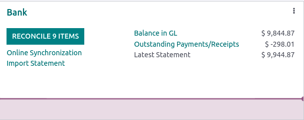

===============
Bank statements
===============

Importing bank statements allows keeping track of bank account transactions and reconcile them with
the ones recorded in Odoo.

With :doc:`bank synchronization <bank_synchronization>` feature, the process is automated. However,
if you do not want to use it or if your bank is not yet supported, other options exist:

- :ref:`Import bank statements <import-statements>` delivered by your bank;
- :ref:`Register bank transactions <register-transactions>` manually.

.. _import-statements:

Import bank statements
======================

Odoo supports multiple file formats to import bank statements:

- SEPA recommended Cash Management format (CAMT.053);
- Comma-separated values (.CSV);
- Open Financial Exchange (.OFX);
- Quicken Interchange Format (.QIF);
- Belgium: Coded Statement of Account (.CODA).

To import a file, go to the :guilabel:`Accounting Dashboard` and in the :guilabel:`Bank` journal,
on :guilabel:`Import Statement`.

Next, select the file you want to import and upload it.

After setting the necessary formatting options and mapping the needed columns, you have the
possibility to make a :guilabel:`Test` or you can directly :guilabel:`Import` your bank statement
files.

.. _register-transactions:

Register bank transactions manually
===================================

You can also record your bank transactions manually. To do so, go to
:guilabel:`Accounting Dashboard`, click on the :guilabel:`Bank` journal and then on
:guilabel:`New`. Make sure to fill out the :guilabel:`Partner` and :guilabel:`Label` fields to
ease the reconciliation process.

