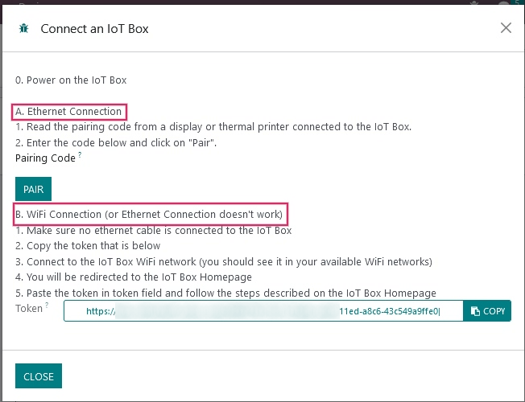
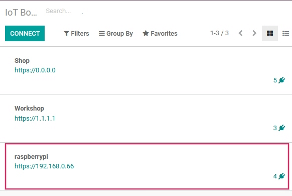
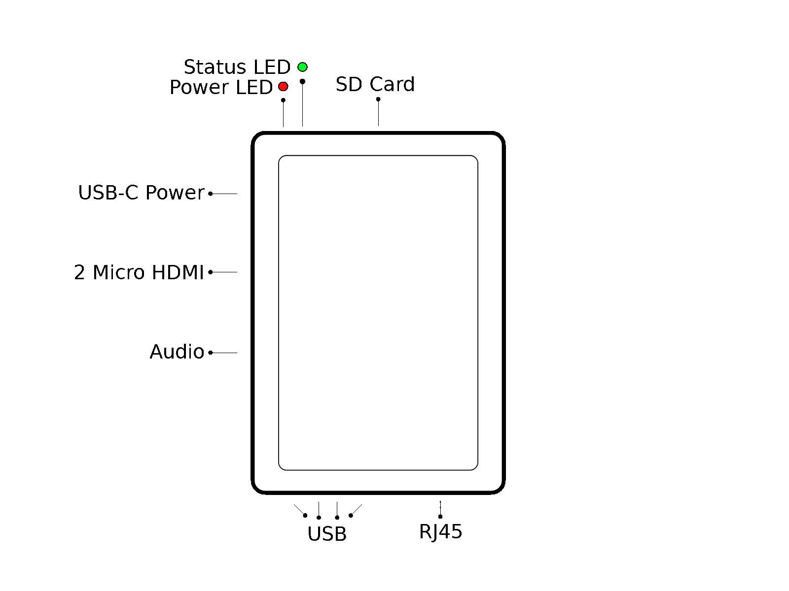

=======================================
Connect an IoT Box to the Odoo database
=======================================

Install the :menuselection:`Internet of Things (IoT)` App on the Odoo database.

.. image:: connect/connect01.png
   :align: center
   :alt: The Internet of Things (IoT) App on the Odoo database.

Go to the :menuselection:`IoT` App and click on :guilabel:`Connect`` on the
:abbr:`IoT (Internet of Things)` IoT Boxes page.

.. image:: connect/connect09.png
   :align: center
   :alt: Connecting an IoT box to the Odoo database.

Follow the steps to connect the IoT Box.

.. note::
   Ensure the :abbr:`IoT (Internet of Things)` box is flashed with the most up-to-date
   :abbr:`IoT (Internet of Things)` image.

Ethernet Connection
===================

#. Connect all the devices that have to be connected with cables to the
   :abbr:`IoT (Internet of Things)` box (ethernet, usb devices, etc.).

#. Power on the :abbr:`IoT (Internet of Things)` Box.

#. Read the :guilabel:`Pairing Code` from a screen or a receipt printer connected to the
   :abbr:`IoT (Internet of Things)` Box.

#. Input the :guilabel:`Pairing Code` on the :abbr:`IoT (Internet of Things)` module of the database
   and click on the :guilabel:`Pair` button.

WiFi Connection
===============

#. Connect all the devices that have to be connected with cables to the
   :abbr:`IoT (Internet of Things)` box (ethernet, usb devices, etc.).

#. Power on the :abbr:`IoT (Internet of Things)` Box.

#. Copy the :guilabel:`Token` from the :guilabel:`WiFi connection`section in
   :menuselection:`IoT` module of the Odoo database.

#. Connect to the :abbr:`IoT (Internet of Things)` Box WiFi Network (make sure there is no ethernet
   cable plugged in the computer).

   .. image:: connect/connect-iot-wifi.png
      :align: center
      :alt: WiFi networks available on the computer.

#. Upon connecting to the :abbr:`IoT (Internet of Things)` WiFi a browser will automatically
   redirect to the :abbr:`IoT (Internet of Things)` Box Homepage. Give a name to the
   :abbr:`IoT (Internet of Things)` Box, paste the previously copied token into the
   :guilabel:`Server Token` field, and then click on :guilabel:`Next`.

   .. image:: connect/server-token.png
      :align: center
      :alt: Enter the server token into the IoT box.

#. Choose the WiFi network that the :abbr:`IoT (Internet of Things)` box will connect with (enter
   the password if there is one) and click on :guilabel:`Connect`. Wait a few seconds before being
   redirected to the database. The computer may need to be manually connected back to WiFi.

   .. image:: connect/configure-wifi-network-iot.png
      :align: center
      :alt: Configuring the WiFi for the IoT box.

The :abbr:`IoT (Internet of Things)` box should appear in the :menuselection:`IoT` module of the
Odoo database.

IoT Box Schema
==============

